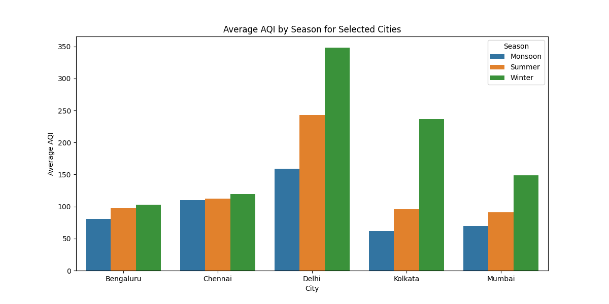
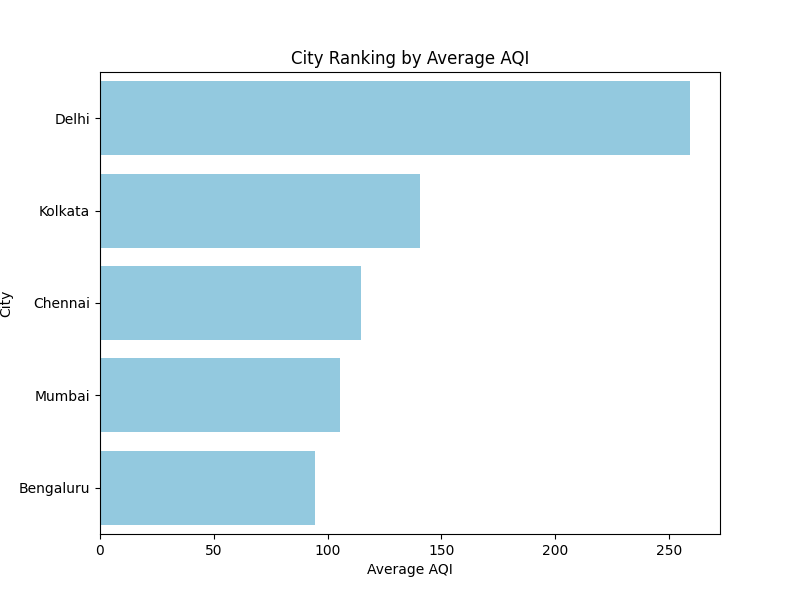
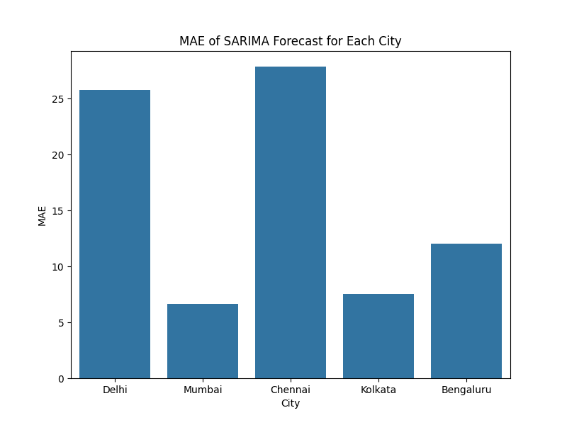
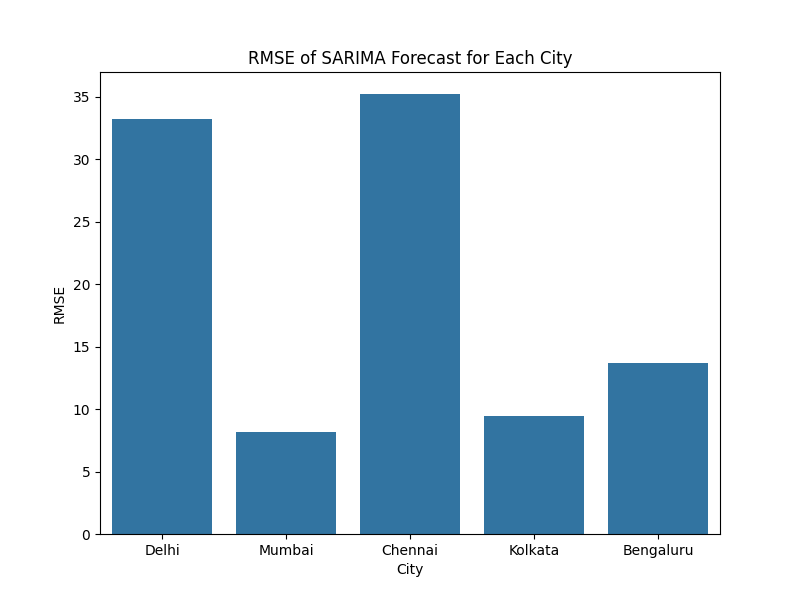

# Air Quality Index (AQI) Analysis & Forecasting  

## 📌 Overview  
This project analyzes and forecasts Air Quality Index (AQI) trends for multiple Indian cities.  
Using **Python** for data cleaning, analysis, and SARIMA forecasting, and **Tableau** for interactive dashboards, the project provides insights into seasonal patterns, pollution severity, and predictive accuracy.  

---

## ⚙️ Features  
- Data cleaning and preprocessing with **Pandas**  
- Seasonal trend analysis and city ranking  
- Time-series forecasting with **SARIMA**  
- Model evaluation using **MAE** and **RMSE**  
- Exported summary metrics (`city_AQI_summary.csv`)  
- Interactive **Tableau Dashboard** published online  

---

## 🛠 Tech Stack  
- Python (Pandas, Matplotlib, Seaborn, Statsmodels, Scikit-learn)  
- Tableau Public  

---

## 📊 Results & Visualizations  

### Historical AQI Trends
  

### Seasonal AQI Comparison
  

### City Ranking by Average AQI
  

### Forecast Evaluation – MAE
  

### Forecast Evaluation – RMSE
  

---

## 📈 Interactive Dashboard  
👉 View the live Tableau Dashboard here:  
[**AQI Dashboard (Tableau Public)**](https://public.tableau.com/app/profile/hemal.sri.v/viz/AirQualityIndexAnalysis_17581269840360/AQIDashboard)  

---

## 📂 Dataset  
Source: [Kaggle – Air Quality Data in India (2015–2020)](https://www.kaggle.com/datasets/rohanrao/air-quality-data-in-india)  

---

